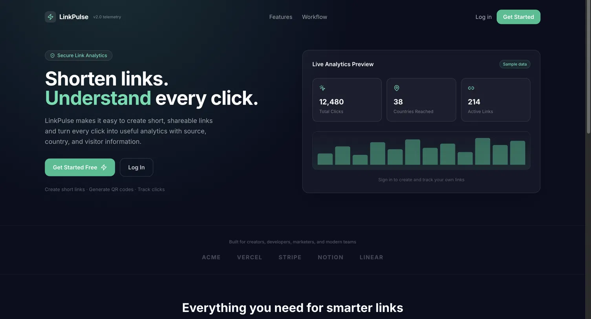
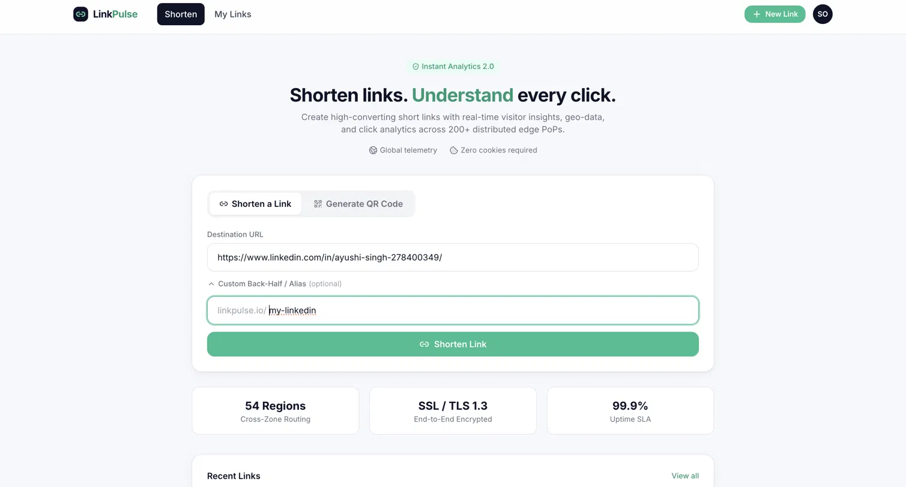
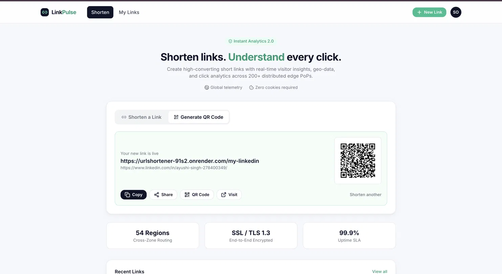
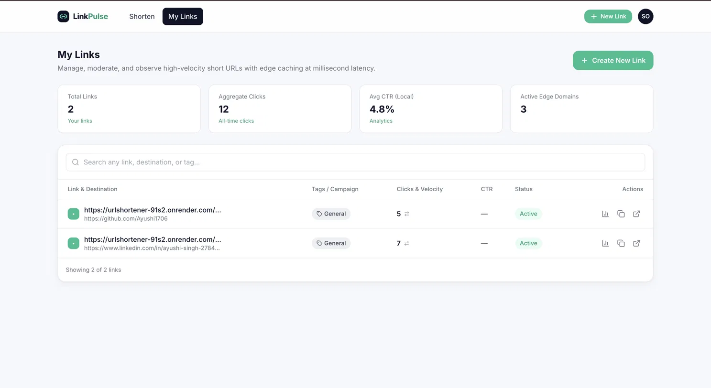
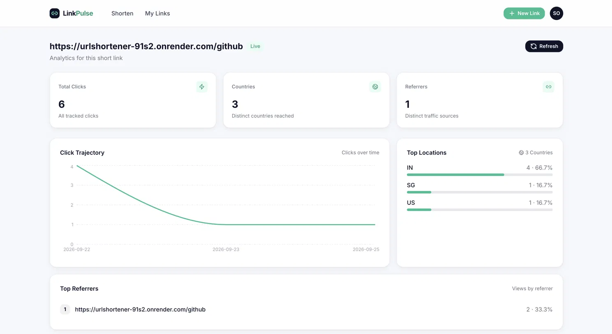

# LinkPulse — URL Shortener & Link Analytics Platform

A production-grade URL shortener with real-time click analytics, built with Spring Boot, React, and PostgreSQL. Create short, shareable links and understand every click with detailed visitor insights.

**Live Demo**: [https://url-shortener-azure-tau.vercel.app](https://url-shortener-azure-tau.vercel.app)

---

##  What is LinkPulse?

In one sentence: **A platform where you paste a long URL, get a short link back, and see real-time analytics about who clicked it, where they're from, and what device they used.**

### Two Core Features

1. **The Shortener** — Turn long URLs into short, shareable links instantly
2. **The Analytics** — Track every click with geo-location, referrer, device info, and timestamps

---

## ✨ Key Features

-  **Instant Link Generation** — Create short URLs in milliseconds
-  **Custom Aliases** — Set your own short code (e.g., `linkpulse.io/my-link`)
-  **QR Code Generation** — Automatically generate scannable QR codes
-  **Real-Time Analytics** — View clicks, countries, referrers, and device info live
-  **Click Trajectory** — Visualize click trends over time
-  **Google OAuth2 Authentication** — Secure login with Google
-  **User Accounts** — Each user owns and manages their own links
-  **Link Management** — View, edit, and delete your links
-  **Edge Caching** — Lightning-fast redirects with Redis caching
-  **Geo-Location Tracking** — Know which countries your traffic comes from
-  **Responsive Design** — Works on desktop, tablet, and mobile

---

## ️ Architecture Overview

LinkPulse uses a modern microservices-inspired architecture with clear separation of concerns.

### System Components

```
Frontend (Next.js/React)
├── Login & Authentication
├── Dashboard
├── Create/Manage Links
└── Analytics Visualization
        ↓ (API Calls)
Backend (Spring Boot)
├── OAuth2 Handler
├── Link Service
├── Redirect Handler
└── Analytics API
        ↓
Databases
├── PostgreSQL (Users, Links, Analytics)
├── Redis (Cache for fast redirects)
└── Kafka (Asynchronous events)
```

### How a Click Works (Data Flow)

1. **User clicks** `linkpulse.io/my-link`
2. **Backend checks Redis** — Is this link cached? (≈1ms)
3. **If not cached** — Query PostgreSQL (≈10ms)
4. **Save to cache** — Next lookup will be instant
5. **Redirect user** — 302 redirect to original URL (≈5-10ms total)
6. **Async analytics** — Publish click event to Kafka (non-blocking)
7. **Consumer processes** — Save analytics data for dashboard
8. **Dashboard shows** — Real-time charts and stats

**Key insight**: Redirect never waits for analytics write. The "fast path" and "slow path" are completely decoupled.

---

## 💻 Tech Stack

### Frontend
- **Next.js 14** — React framework for production apps
- **JavaScript** — The language of the web for React development
- **Tailwind CSS** — Utility-first styling
- **Recharts** — Beautiful, responsive charts
- **React Router** — Client-side routing

### Backend
- **Spring Boot 3.x** — Enterprise Java framework
- **Spring Security** — OAuth2 authentication
- **Spring Data JPA** — Database ORM
- **JWT** — Stateless authentication tokens

### Databases & Storage
- **PostgreSQL** — Primary database (links, users, clicks)
- **Redis** — Cache layer for fast redirects
- **Kafka** (optional) — Asynchronous event processing

### Deployment
- **Render** — Backend hosting
- **Vercel** — Frontend hosting
- **GitHub** — Version control

---

## 🚀 Getting Started

### Prerequisites

- Node.js 18+ (frontend)
- Java 17+ (backend)
- PostgreSQL 14+ (database)
- Redis 7+ (optional, for caching)

### Backend Setup

#### 1. Clone Repository
```bash
git clone https://github.com/Ayushi1706/URLShortener.git
cd URLShortener
```

#### 2. Configure Environment Variables

Create `.env` or set on your hosting platform:

```env
# Database
DB_HOST=your-postgres-host
DB_PORT=5432
DB_NAME=linkpulse_db
DB_USERNAME=postgres
DB_PASSWORD=your-password

# Redis
REDIS_HOST=your-redis-host
REDIS_PORT=6379
REDIS_PASSWORD=your-password

# JWT
JWT_SECRET=your-random-32-character-secret-key-here
JWT_EXPIRATION=86400000

# Google OAuth2
GOOGLE_CLIENT_ID=your-google-client-id
GOOGLE_CLIENT_SECRET=your-google-client-secret
GOOGLE_REDIRECT_URI=https://your-backend.onrender.com/login/oauth2/code/google

# Frontend
FRONTEND_BASE_URL=https://your-frontend.vercel.app
APP_BASE_URL=https://your-backend.onrender.com
```

#### 3. Install Dependencies
```bash
mvn clean install
```

#### 4. Run Locally
```bash
mvn spring-boot:run
```

Backend available at `http://localhost:8080`

### Frontend Setup

#### 1. Navigate to Frontend Directory
```bash
cd frontend
```

#### 2. Install Dependencies
```bash
npm install
```

#### 3. Create `.env.local`
```env
VITE_API_URL=http://localhost:8080/api
```

#### 4. Run Locally
```bash
npm run dev
```

Frontend available at `http://localhost:5173`

---

## 📸 Screenshots

### Home Page - Feature Showcase
Landing page with highlights of core features and analytics preview.


### Login Page - Google OAuth
Secure authentication with email/password or instant Google login.


### Create Short Link
Simple, fast form to paste a URL and instantly get a short link with QR code.


### Link Successfully Created
Shows generated short link, QR code, sharing options, and quick action buttons.


### My Links Dashboard
Comprehensive view of all user links with aggregate click counts and basic metrics.


### Real-Time Analytics
Detailed analytics dashboard showing:
- Total clicks (all-time)
- Countries reached
- Top referrers
- Click trajectory over time
- Geographic breakdown
- Referrer breakdown


---

## 🔑 Core API Endpoints

### Authentication
```
POST   /api/auth/login              Login with email & password
POST   /api/auth/register           Create new account
GET    /oauth2/authorization/google Redirect to Google login
GET    /login/oauth2/code/google    OAuth2 callback (auto-handled)
```

### Links
```
POST   /api/links                   Create new short link
GET    /api/links                   Get user's links
GET    /{shortCode}                 Redirect to original URL + log click
DELETE /api/links/{id}              Delete a link
```

### Analytics
```
GET    /api/analytics/{shortCode}   Get analytics data for a link
```

---

## 🔐 Authentication & Security

### Google OAuth2 Flow

1. User clicks "Google SSO" button
2. Frontend redirects to `/oauth2/authorization/google`
3. Spring Security handles OAuth negotiation with Google
4. User authenticates on Google login page
5. Google redirects back to backend with authorization code
6. Backend exchanges code for Google tokens
7. Backend creates/finds user in database
8. Backend generates JWT token
9. User redirected to `/oauth/callback?token=JWT_TOKEN`
10. Frontend stores JWT in localStorage
11. Subsequent requests include JWT in `Authorization: Bearer {token}` header

### JWT Token Format
```json
{
  "sub": "user@example.com",
  "userId": 123,
  "email": "user@example.com",
  "iat": 1696348800,
  "exp": 1696435200
}
```

### Security Features
-  OAuth2 (no passwords stored for social login)
-  JWT with expiration (24-hour default)
-  CORS protection
-  Password hashing with BCrypt
-  HTTPS only (in production)

---

## 📊 Analytics Tracking

### Data Collected Per Click
- **Timestamp** — Exact moment of click
- **IP Address** — Visitor's location source
- **Country** — Geo-located from IP
- **User Agent** — Browser, OS, device type
- **Referrer** — Where traffic came from
- **Short Code** — Which link was clicked

### Analytics Dashboard Shows
- Total clicks (all-time and trends)
- Unique countries reached
- Top traffic sources (referrers)
- Device/browser breakdown
- Click trajectory (graph over time)
- Geographic heatmap

---

## ⚡ Performance Optimizations

### 1. Redis Caching (Cache-Aside Pattern)
**Strategy**: Check cache first, then database, then update cache

```
First request:  Redis ❌ → PostgreSQL ✓ → Cache result
Next requests:  Redis ✓ (≈1ms) → Done
```

**Result**: Redirects from ≈50ms (DB) to ≈5ms (cache)

### 2. Asynchronous Analytics
- Redirect happens immediately (blocking on cache/DB only)
- Click event published to Kafka queue (non-blocking)
- Consumer processes analytics in background
- **Result**: User never waits for analytics writes

### 3. Database Optimization
- Index on `short_code` → Fast link lookups
- Index on `user_id` → Fast permission checks
- Aggregate analytics table → Fast chart queries

### 4. Frontend Optimizations
- Next.js automatic code-splitting
- Image optimization & lazy loading
- CSS minimization
- Recharts renders only visible data points

---

## 🔧 Configuration Details

### Redirect Status Code
- **Current: 302 (Temporary)** — Ideal for analytics
    - Browser doesn't cache
    - Every click sends request to server
    - We can log every single click

- **Alternative: 301 (Permanent)**
    - Browser caches forever
    - Subsequent clicks don't hit server
    - We miss analytics data
    - ❌ Not recommended for analytics

### Base62 Encoding
Short codes use characters: `a-z, A-Z, 0-9` (62 total)

```
6-char code  = 62^6 = 56+ billion unique IDs
8-char code  = 62^8 = 218+ trillion unique IDs
```

Why? Shorter URLs are easier to share and remember.

---

## 🎓 Architecture Patterns Used

### 1. Cache-Aside Pattern
```
if (cache.exists(key)):
    return cache.get(key)
else:
    value = database.get(key)
    cache.set(key, value)
    return value
```

### 2. Asynchronous Processing
```
redirect_user(link)                    // Blocking on fast path only
publish_to_queue(click_event)         // Non-blocking
// Consumer processes async:
subscribe_to_queue():
    save_analytics(click_event)
```

### 3. Separation of Concerns
- **Redirect** concerns: Fast, critical path
- **Analytics** concerns: Can be eventual, non-critical
- These are **completely decoupled** via Kafka

---

## 🚨 Troubleshooting

### OAuth2 Shows "Invalid Credentials"

**Check these in order:**

1. **Google Cloud Console**
    - Verify Client ID and Secret
    - Confirm **Authorized JavaScript origins** includes your backend domain
    - Confirm **Authorized redirect URIs** is exactly:
      ```
      https://your-backend.onrender.com/login/oauth2/code/google
      ```

2. **Environment Variables on Render**
    - Check all 3 OAuth vars are set:
        - `GOOGLE_CLIENT_ID`
        - `GOOGLE_CLIENT_SECRET`
        - `GOOGLE_REDIRECT_URI`

3. **Restart Backend**
    - Click **Restart service** on Render dashboard
    - Wait for "Your service is live 🎉"

### Analytics Not Showing

**Check these:**

1. Is backend running? → `curl https://your-backend.onrender.com/health`
2. Are clicks being recorded? → Check database:
   ```sql
   SELECT COUNT(*) FROM click_events;
   ```
3. Is consumer running (if using Kafka)?

### Slow Redirects

**Check this:**

1. Is Redis connected? → Backend logs should show connection
2. Is the link cached? → First redirect is slow, subsequent are fast
3. Check Render performance metrics

---

## 📈 Database Schema

### Users Table
```sql
CREATE TABLE users (
  id BIGINT PRIMARY KEY,
  email VARCHAR(255) UNIQUE NOT NULL,
  password_hash VARCHAR(255),
  created_at TIMESTAMP DEFAULT NOW(),
  updated_at TIMESTAMP DEFAULT NOW()
);
```

### Links Table
```sql
CREATE TABLE links (
  id BIGINT PRIMARY KEY,
  short_code VARCHAR(20) UNIQUE NOT NULL,
  original_url TEXT NOT NULL,
  user_id BIGINT NOT NULL,
  created_at TIMESTAMP DEFAULT NOW(),
  updated_at TIMESTAMP DEFAULT NOW(),
  FOREIGN KEY (user_id) REFERENCES users(id),
  INDEX(short_code),
  INDEX(user_id)
);
```

### Click Events Table
```sql
CREATE TABLE click_events (
  id BIGINT PRIMARY KEY,
  short_code VARCHAR(20) NOT NULL,
  click_time TIMESTAMP DEFAULT NOW(),
  ip_address VARCHAR(45),
  user_agent TEXT,
  referrer VARCHAR(255),
  country VARCHAR(2),
  FOREIGN KEY (short_code) REFERENCES links(short_code),
  INDEX(short_code),
  INDEX(click_time)
);
```

---

## 🚀 Deployment

### Deploy Backend to Render

1. Push code to GitHub
2. Connect GitHub repository to Render
3. Set environment variables in Render dashboard
4. Render auto-deploys on every push

### Deploy Frontend to Vercel

1. Push code to GitHub
2. Connect GitHub to Vercel
3. Set environment variable: `VITE_API_URL`
4. Vercel auto-deploys on every push

### Update OAuth Redirect URIs
Whenever you deploy, update Google Cloud Console:
```
https://your-actual-backend.onrender.com/login/oauth2/code/google
```

---

## 🎓 Learning Resources

### Concepts Used in This Project
1. **OAuth2** — Industry-standard authentication protocol
2. **JWT** — Stateless token-based authentication
3. **Redis Caching** — In-memory data store for performance
4. **Message Queues** — Decoupling services with Kafka
5. **Base62 Encoding** — URL-safe number-to-string conversion
6. **Geo-IP** — Locating users by IP address
7. **Async/Non-blocking** — Preventing slow operations from blocking users

### Recommended Reading
- [OAuth 2.0 Explained](https://www.oauth.com/)
- [URL Shortening Architecture](https://www.educative.io/blog/system-design-url-shortener)
- [Redis Best Practices](https://redis.io/docs/management/optimization/)
- [Spring Boot & OAuth2](https://spring.io/projects/spring-security-oauth2-client)

---

## 🤝 Contributing

Found a bug or have a suggestion? Open an issue or submit a pull request!

Areas for improvement:
- Link expiration dates
- Password-protected links
- Custom domain support
- Advanced device analytics
- Rate limiting per user
- API key authentication

---

##  License

MIT License — feel free to use this project for learning or as a starter template.

---

##  Author

**Ayushi Singh**
- GitHub: [@Ayushi1706](https://github.com/Ayushi1706)
- Email: ayushi1705singh@gmail.com

---


